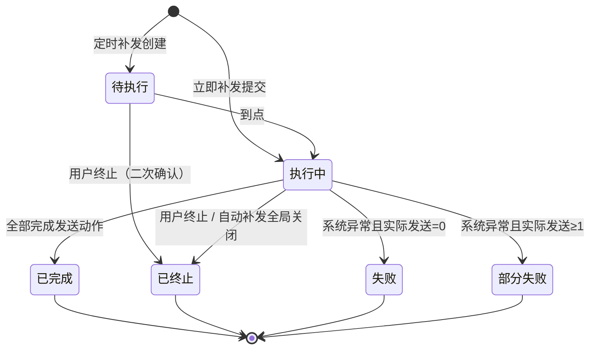

# PRD：DigiOps 短信触达与补发管理平台（V2 定版）

> 版本：V2.0 ｜ 日期：2026-08-20 ｜ 状态：需求冻结
> 依据：已定版高保真原型（sms-message）+ 主规格（`.spec/spec.html`）
> 用途：研发开发、测试验收、产品评审的唯一需求依据

## 1. 概述与范围

本平台让运营人员可**追踪短信发送与送达结果**、**对失败/未送达短信做受控补发**、**统一管理黑名单**，并在**运营计划中配置发送前校验与失败后补发策略**。

本期范围（原型已定版）：

| 模块 | 内容 |
| --- | --- |
| 短信管理 | 发送记录（含送达状态机）、模板、报表 |
| 补发中心 | 人工补发、自动补发、批次记录与详情 |
| 黑名单 | 名单库管理（用户管理子边栏入口） |
| 运营计划 | 计划列表 + 流程画布（前置校验 / 补发控制） |

不在本期：真实登录鉴权、接口联调、真实导出文件、模板新建/编辑完整表单、失败批次重试。

## 2. 目标与关键结果

目标：把短信触达从“发出即结束”变成“可追踪、可补偿、可治理”的闭环。

| 关键结果 | 衡量方式 |
| --- | --- |
| 发送结果可追踪 | 发送记录覆盖 7 种状态场景（成功/失败/暂无数据 + 回执中/已送达/未送达/回执超时） |
| 失败可补救 | 人工补发全流程可走通；自动补发按规则聚批补偿 |
| 打扰可控制 | 黑名单全局生效；自动补发默认强制排除黑名单 |
| 计划可配置 | 画布支持前置校验 + 补发控制，配置可保存、刷新后恢复 |

## 3. 术语与口径

| 术语 | 定义 |
| --- | --- |
| 发送状态 | 短信提交通道的结果：成功 / 失败 / 暂无数据 |
| 送达状态 | 回执结果：回执中 / 已送达 / 未送达 / 回执超时 / `--` |
| 回执超时 | 24 小时内无明确回执 |
| 补发 | 对满足条件的短信再次执行发送动作 |
| 批次 | 一次补发动作的集合，人工/自动共用批次模型（前缀 B/A 区分） |
| 提交校验数量 | 提交前用户点击校验获得的补发数量 |
| 实际发送数量 | 执行过程中分批校验通过并执行发送动作的累计条数（含单条提交失败） |
| 命中 | 筛选条件下满足补发条件的短信数 |
| 黑名单 | 全局名单资产，供人工补发、自动补发、运营计划复用 |

## 4. 功能需求

### 4.1 短信管理

**发送记录**

- 筛选字段（11 个）：发送时间、BusinessID、计划名称、用户分组、手机号码、内容类型、发送名称、发送状态、送达状态、补发批次 ID、路径标记。
- 列表 13 列，横向滚动，分页 10 条/页；导出需填写导出名称（必填）。
- 送达状态规则（用户已确认，全量组合见 §5.1）：
  - 发送成功 → 回执中 / 已送达 / 未送达 / 回执超时；
  - 发送失败 → `--`；暂无数据 → `--`；历史短信 → `--`。
- 状态列 hover 气泡说明（见 §5.1 文案表）；补发批次 ID 可跳转补发记录并自动填入筛选。

**模板 / 报表**

- 模板：搜索 + 新建入口 + 列表（本期模板数据为空）。
- 报表：近 7 天 / 近 30 天 / 近半年切换、发送量折线图、到达率环形图、费用统计、发送明细表（演示数据）。

**验收标准（4.1）**

| # | 操作 | 预期 |
| --- | --- | --- |
| 4.1.1 | 打开发送记录 | 默认展示发送记录，7 种状态场景均有对应展示 |
| 4.1.2 | 查看发送状态=失败的送达状态 | 显示 `--`，hover 提示“发送失败，无回执” |
| 4.1.3 | 点击导出 | 弹窗要求填写导出名称，未填时确定置灰 |
| 4.1.4 | 从补发详情点“查看发送记录” | 跳转发送记录并自动填入补发批次 ID |

### 4.2 补发中心

#### 4.2.1 人工补发

流程：**条件筛选 → 命中汇总 → 补发弹窗（配置+校验）→ 批次记录**。

- 筛选：与发送记录同款字段；**默认不选任何条件时查询按钮置灰**，hover 提示“请至少选择一项筛选条件”；填写任意字段后可查询；重置后恢复置灰。
- 命中汇总：展示“当前筛选项下命中 X 条，其中黑名单命中 Y 条，任务执行时将重新校验”；命中 0 条时仅红字展示“当前条件筛选下无命中”；用户未选择黑名单策略前**不展示“实际可补”数量**。
- 补发弹窗（单弹窗完成，无“下一步/上一步”）：
  - 补发方式（立即/定时）；
  - 预计补发时间：定时可编辑且必须晚于当前时间，未填显示灰色“请选择补发时间”，早于当前标红；立即固定“立即执行”；
  - 黑名单用户是否发送：**默认不选中**；未选前不展示黑名单提示条，校验/确认均置灰并 hover 提示；
  - 黑名单提示随选择即时切换（“所补发用户将不含有/含有黑名单用户”）；
  - 补发数量：点击“校验”后原地展示最新数量；**校验后修改时间或黑名单选项，校验结果清空、确认键重新置灰**；
  - 底部仅“取消 / 确认补发”；校验完成且时间有效前确认置灰。
- 提交成功后：清空筛选、隐藏命中面板、批次置顶展示（防止重复提交）。

#### 4.2.2 自动补发

**开关**：独立展示于顶部状态条，默认**关闭**。

- 关闭状态：规则可编辑、可保存；未完成必填配置时不允许开启（toast 提示）。
- 开启状态：规则锁定不可编辑；队列摘要展示“队列中 X 条 · 预计发送时间 · 满 X 条提前触发”。
- 开关均需二次确认：
  - 开启：“开启后，满足触发条件的失败短信将由系统自动补发，请确认规则已配置正确”；
  - 关闭：“关闭后，系统将立即停止自动补发，已有的自动补发队列会被清空，进行中的人工补发不受影响”。

**规则配置**（必填项红星；默认不替用户选）：

| 字段 | 规则 |
| --- | --- |
| 触发条件 | 提交失败时（发送失败）；回执判定后（未送达 / 回执超时）。至少选 1 个 |
| 最多补发次数 | 同一条短信最多自动补发次数；=1 时补发时间间隔置灰且不参与必填 |
| 补发时间间隔 | 同一条短信两次自动补发的最小间隔（不计算人工补发） |
| 最大排队数量 | 下拉固定档位：100 / 500 / 1,000 / 2,000 / 5,000 / 10,000，默认 1,000 |
| 批次最长等待 | 从批次首条短信入队起算，默认 15 分钟 |
| 生效时段 | 全天 / 指定时段；默认无选择；指定时段最多 3 段、不允许重合 |

**统计**：累计补发 / 补发成功 / 补发失败 / 待确认 / 队列中，支持按运营计划筛选；同一条短信补发两次计 2 条。

**记录**：批次维度，字段：补发批次 ID（A 前缀）、当前状态、开始/结束时间、实际发送数量、操作（详情）；不提供单批次终止（止血用全局开关）。

**生效范围**：

- 2026.8.24 日前的历史短信不参与自动补发；
- 全局规则默认生效；运营计划画布若配置了自动补发组件，以计划配置为准；
- 自动补发默认强制校验黑名单，命中黑名单的短信不补发，不提供“含黑名单发送”选项。

#### 4.2.3 批次状态机（六态，人工/自动共用）

| 状态 | 触发条件 | 执行完整性 | 可操作 |
| --- | --- | --- | --- |
| 待执行 | 定时补发已创建、时间未到 | 未开始 | 终止、详情 |
| 执行中 | 立即补发提交后；定时补发到点后 | 进行中 | 终止、详情 |
| 已完成 | 所有应发短信均完成发送动作（发出/尝试发出） | 100% | 详情 |
| 已终止 | 人工=用户主动终止（仅待执行/执行中）；自动=全局关闭立即中断 | 部分处理完 | 详情 |
| 失败 | 系统异常且实际发送数量 = 0（启动前失败或执行开始即中断） | 未实际发送 | 详情 |
| 部分失败 | 系统异常且实际发送数量 ≥ 1（执行中中断） | 部分处理完 | 详情 |

**关键定义**：“已完成”= 对每条短信都做了发送动作；明细发送状态（成功/失败/暂无数据）是发送动作之后的结果，不影响批次状态。批次层看“发没发”，明细层看“发得怎么样”。

**数量口径**：

- 提交校验数量 = 提交前用户校验的补发数量；创建批次即有。
- 实际发送数量 = 执行过程中分批校验通过并执行发送动作的累计条数（含单条提交失败）；待执行显示 `--`，执行中显示累计进度，终态定格。
- 执行模型：分批滚动“校验 → 发送”，每批校验通过立即发送该批，再校验下一批。
- 相对提交校验数量只可能**减少**（执行期剔除：退订 / 号码失效 / 重复补发），不可能增加；新增符合条件的短信不进当前批次，留待下一次补发。

#### 4.2.4 队列与聚批规则

| 规则 | 值 |
| --- | --- |
| 扫描周期 | 后端参数，建议 5 分钟，不在规则页暴露 |
| 聚批条件 1 | 达到最大排队数量（默认 1,000）立即聚批 |
| 聚批条件 2 | 未达最大排队数量，但批次首条入队已满批次最长等待（默认 15 分钟） |
| 聚批条件 3 | 无待补短信则跳过（空批次不发） |
| 间隔约束 | 同一条短信两次自动补发之间遵守补发时间间隔 |
| 上限约束 | 达到最多补发次数后不再进入补发队列 |

**验收标准（4.2）**

| # | 操作 | 预期 |
| --- | --- | --- |
| 4.2.1 | 打开人工补发，不选条件点查询 | 按钮置灰，hover 提示“请至少选择一项筛选条件” |
| 4.2.2 | 填写任一条件并查询 | 命中面板出现；每两次查询至少触发一次 0 命中红字 |
| 4.2.3 | 定时补发：不填时间 / 填过去时间 | 不填显示灰色提示；过去时间标红；校验与确认均置灰 |
| 4.2.4 | 补发弹窗不选黑名单选项 | 校验/确认置灰，hover 提示缺失项 |
| 4.2.5 | 校验后修改时间或黑名单选项 | 校验结果清空、确认键重新置灰 |
| 4.2.6 | 提交补发 | 弹窗关闭、筛选清空、新批次置顶；定时批次=待执行，立即批次=执行中 |
| 4.2.7 | 规则未配置完整点开启 | 不允许开启并 toast 提示 |
| 4.2.8 | 开启后编辑规则 | 规则体锁定、保存置灰 |
| 4.2.9 | 关闭自动补发 | 二次确认；队列清空；执行中批次变“已终止”；人工补发不受影响 |
| 4.2.10 | 最多补发次数选 1 | 补发时间间隔置灰，保存/开启不受阻 |
| 4.2.11 | 批次详情点“查看发送记录” | 跳转并按补发批次 ID 过滤 |
| 4.2.12 | 非终态批次点“导出明细” | 置灰，hover“待任务结束后可导出”；终态（完成/终止/失败/部分失败）可导出 |

### 4.3 黑名单（用户管理子边栏）

- 统计卡：名单总数 / 生效中 / 已失效 / 今日拦截。
- 筛选：手机号码、BusinessID、状态、添加日期（起止）。
- 新增：手机号码批量输入（每行一个）、BusinessID、有效期（永久 / 指定时间，**默认不选中**；“指定时间”= 开始日期 → 结束日期，均默认空、用户自填、都填后才可确定）。
- 列表操作：查看详情、生效、失效、移除（均二次确认）；复选框批量操作（批量生效 / 失效 / 移除 / 导出选中，跨页保留选择）；导出弹窗导出名称必填，演示含成功与失败两种结果（失败不关闭弹窗并提示错误）。
- 状态语义：
  - 失效 = 暂停拦截、名单保留、可随时恢复；
  - 生效 = 恢复参与人工补发、自动补发及运营计划拦截校验；
  - 移除 = 永久删除，需重新导入。
- 使用方：人工补发（提交前可选手动过滤）、自动补发（默认强制校验）、运营计划前置校验（可选配置）。

**验收标准（4.3）**

| # | 操作 | 预期 |
| --- | --- | --- |
| 4.3.1 | 用户管理子边栏点击黑名单 | 进入独立黑名单页，统计/筛选/列表完整 |
| 4.3.2 | 新增黑名单不选有效期 | 确定置灰 |
| 4.3.3 | 指定时间只填开始日期 | 确定置灰；开始+结束都填后可确定 |
| 4.3.4 | 行内失效 → 生效 | 状态切换；失效时暂停拦截，生效后恢复 |
| 4.3.5 | 移除 / 批量移除 | 二次确认；移除后名单消失 |
| 4.3.6 | 导出不填名称 | 确定置灰；失败场景弹窗不关闭并提示错误 |

### 4.4 运营计划管理

- 计划列表：批次信息 + 操作列（详情进入画布）；支持新建计划入口。
- 画布能力：左侧节点面板（进入 / 动作 / 渠道）、节点拖入画布、拖动、四向端口连线、节点配置面板、本地保存（localStorage，刷新后可继续编辑）。
- 判断节点事件类型：事件发生 / 业务属性 / 群组人数 / **前置校验**。
- 前置校验配置：
  - 校验项：黑名单校验、发送时段校验（可多选）；黑名单旁“查看黑名单”链接可跳转黑名单页；
  - 允许发送时段：最多 3 段，端点相接允许、重合拦截；
  - 非允许时段固定提示：“非允许时段内发送将自动挂起，等到下一允许时段再继续”。
- 补发控制（动作组独立组件）：
  - 触发条件：提交失败 / 未送达 / 回执超时；最大补发次数；补发间隔；
  - 语义：流程在此停留，直到补发完成（补发成功或达到上限）后继续；补发前复用画布“前置校验”规则，未配置则不校验。
- 连线规则：网关节点（判断 / 动作判断 / 群组过滤）**最多 2 条出线**，第一条自动标记 YES（绿✓）、第二条 NO（红✕），第 3 条拦截并红 toast。
- 默认示例链路：客户群组 → 判断（前置校验）→ 短信 → 补发控制 → 结束节点；命中黑名单分支 → 另一结束节点。

**验收标准（4.4）**

| # | 操作 | 预期 |
| --- | --- | --- |
| 4.4.1 | 进入画布 | 展示默认示例链路，节点可拖入/拖动/连线 |
| 4.4.2 | 点击判断节点 | 可配置前置校验（黑名单 + 时段），保存后节点显示“前置校验”摘要 |
| 4.4.3 | 时段重合 | 拦截并提示 |
| 4.4.4 | 网关节点拉第 3 条线 | 拦截并红色提示 |
| 4.4.5 | 点击“查看黑名单” | 跳转黑名单页 |
| 4.4.6 | 保存后刷新页面 | 画布节点与连线恢复 |

## 5. 状态机定义

### 5.1 送达状态机

| 发送状态 | 送达状态 | hover 提示 |
| --- | --- | --- |
| 成功 | 回执中 | 正在等待运营商回执 |
| 成功 | 已送达 | 短信投递成功 |
| 成功 | 未送达 | 短信投递失败 |
| 成功 | 回执超时（24h 无明确回执） | 24 小时内无明确回执 |
| 失败 | `--` | 发送失败，无回执 |
| 暂无数据 | `--` | 发送状态未确认 |
| 历史记录 | `--` | 历史数据，不计算回执 |

### 5.2 批次状态机

判定优先级：已终止 > 部分失败 > 失败 > 待执行（定时未到） > 已完成 > 执行中。

### 5.3 自动补发开关状态机

| 当前 | 动作 | 结果 |
| --- | --- | --- |
| 关闭 | 开启（规则完整） | 二次确认 → 开启；规则锁定 |
| 关闭 | 开启（规则不完整） | 不允许，toast“开启前需完成自动补发规则配置” |
| 开启 | 关闭 | 二次确认 → 立即停止：队列清空、执行中批次置已终止、不再产生新批次；人工补发不受影响 |
| 开启/关闭 | 保存规则 | 关闭态可保存；开启态保存置灰 |

## 6. 边界与异常规则

| # | 场景 | 规则 |
| --- | --- | --- |
| E1 | 无任何筛选条件 | 查询置灰，hover 提示；填写任意字段后可查 |
| E2 | 查询命中 0 条 | 红字“当前条件筛选下无命中”，不展示命中操作 |
| E3 | 命中汇总 | 不展示“实际可补”（未选黑名单策略前） |
| E4 | 定时时间为空 / 早于当前 | 空=灰色提示；早于=标红；校验与确认均置灰 |
| E5 | 黑名单选项未选 | 不展示黑名单提示；校验/确认置灰并 hover 提示缺失项 |
| E6 | 校验后改时间或黑名单 | 校验结果清空、确认置灰 |
| E7 | 送达状态组合 | 发送失败 / 暂无数据 / 历史短信一律 `--`，无“未知” |
| E8 | 自动补发开关关闭时序 | 关闭时：未入队的冷却期短信不再入队，已入队记录清空；重开后扫描器重新按规则捞取仍满足条件且未超上限的短信 |
| E9 | 最多补发次数=1 | 补发时间间隔置灰且不参与必填，保存/开启不受阻 |
| E10 | 生效时段未选 / 指定时段重合 | 未选=保存与开启不可用；重合=拦截 |
| E11 | 历史短信 | 2026.8.24 前不参与自动补发 |
| E12 | 计划级覆盖 | 运营计划配置自动补发组件后，全局规则不生效，按计划配置 |
| E13 | 批次异常 | 失败=系统异常且实际发送 0；部分失败=系统异常且实际发送≥1，保留已发送统计 |
| E14 | 导出权限 | 仅终态（已完成/已终止/失败/部分失败）可导出明细；非终态置灰+hover 提示 |
| E15 | 终止边界 | 仅待执行/执行中可终止，二次确认；终止后部分处理完 |
| E16 | 画布连线 | 网关节点最多 2 条出线，第 3 条拦截 |
| E17 | 黑名单导出 | 名称必填；失败时弹窗不关闭并提示错误 |
| E18 | 黑名单新增 | 有效期未选/日期只填一端时确定置灰 |
| E19 | 批量移除 | 二次确认；语义为永久删除 |
| E20 | 统计口径 | 同一条短信补发两次计 2 条；成功=发送成功且已送达；失败=发送失败或未送达/回执超时；待确认=其余（回执中、暂无数据）；三者之和=累计 |

## 7. 验收总清单（P0 冒烟）

| # | 冒烟路径 | 通过条件 |
| --- | --- | --- |
| S1 | 发送记录 → 状态展示 | 7 种状态场景正确展示，hover 文案正确 |
| S2 | 人工补发全链路 | 查询 → 命中 → 校验 → 确认 → 批次生成，状态正确 |
| S3 | 自动补发规则 → 开启 → 关闭 | 二次确认、规则锁定、队列清空、执行中批次置已终止 |
| S4 | 黑名单新增/失效/生效/移除 | 各交互闭环，二次确认生效 |
| S5 | 画布保存 → 刷新 | 节点与连线恢复；网关第 3 条线被拦截 |
| S6 | 演示站部署 | push main 后 GitHub Actions 成功，演示站加载最新版本 |

## 8. 非功能与交付

- 原型为高保真 React 实现，数据使用 mock（UAT 快照），查询/校验/导出/状态推进均为前端模拟。
- 画布持久化使用 localStorage（键 `axhub-plan-canvas:default`）。
- 演示站：GitHub Pages 自动部署，每次提交自动更新；Make 编辑端、规格、批注为本地能力，不随演示站发布。
- 部署单入口构建（短信原型），约 1–2 分钟。

## 9. 发布规划

| 版本 | 内容 | 状态 |
| --- | --- | --- |
| V1 | 本 PRD 全部功能（原型已定版） | 需求冻结，可进入研发排期 |
| V2 候选 | 模板新建/编辑完整表单与试发、失败批次重试、报表真实口径、接口联调、扫描周期可视化管理 | 未排期 |

## 10. 假设与待确认

- 短信回执落库后可按 messageId 关联回执状态（依赖“短信回执信息落库”需求）。
- 自动补发扫描周期为后端参数（建议 5 分钟），不在规则页暴露。
- 关闭开关后重开：满足条件短信会被重新扫描入队（候选池无 24 小时有效窗口），需后端确认实现口径。
- 失败批次不提供“重试”操作，待产品确认。
- 报表图表与费用数据为演示占位，真实口径待报表需求确认。
- 黑名单“今日拦截”依赖拦截日志，本期为 mock。
